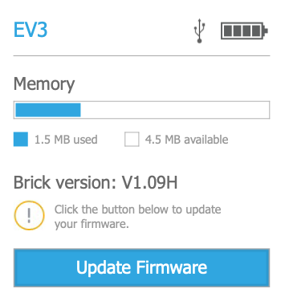

Introduction
============

This tutorial is an introduction on how to program the **LEGO MINDSTORMS EV3**
robot with **Microsoft MakeCode**.

The language MakeCode is a **graphical language** where you assemble blocks to tell the robot what to do.
All the programming is done online **inside a navigator** window (Chrome, Safari, Edge, Firefox) and does not 
need any installation of software.

To program the EV3 go to the following site: 
https://makecode.mindstorms.com/#editor 

MakeCode also has a **simulator** which allows you to see the result of your program immeditely, 
even without downloading it to the EV3 brick.

Hello world
-----------

It is a tradition for most tutorials to start with a program which 
displays **Hello world** on the screen. Here it is.

.. image:: hello1.png

The program displays a line of text on the line you specifiy. 
Here we display it on line nummer 1, but you have up to 12 lines.
When you run it, the simulator dispays this.

.. image:: hello1s.png

Show the mood
-------------

Now let's use the center button to display the mood of the robot.

.. image:: hello2.png

To express a mood you choose from among 12 images showing different types of eyes.
Each image has a different sound associated with it. Choose a mood and test it.

.. image:: hello2b.png

When you press the center button, the robot will display this image.

.. image:: hello2s.png

On start and forever
--------------------

When you create a new project, you have already two blocks on the canvas:

- the **on start** block, 
- the **forever** block.

.. image:: intro1.png

The **on start** block executes all blocks inside exactly once, when the program starts.

The **forever** block is an infinite loop and repeats all the blocks inside until you stop the program.

The following program plays a deep tone (Middle C) at the start, 
and then a higher toone (Tenor C) repeatedly every 1 second.

.. image:: intro1b.png

Download a program
------------------

So far, you could observe the result of your programs in the simulator.
But it's more fun to download them to your robot.
Once you connect the EV3 via a USB cable to your computer, it appears as a hard-disk.

In order to download a program to the brick, click on the **Download** button.
If you have a project called **intro** this will download a file called **intro.uf2** to your download folder.
To run the file on the EV3 you must transfer the file inside the EV3 disk icon.

Inside the preferences of your navigater you can specify to which folder the files are downloaded.
You can either

- automatically save to the **EV3** drive,
- ask each time for the destination.

Upgrade the brick firmware
--------------------------

If the EV3 icon does not appear on your desktop, you must probably upgrade the firmware (FW) of your brick.
You can check the firmware on the brick under

- **Settings** top menu (all to the right)
- **Brick info** sub-menu
- **Brick FW**: V1.09H (H=Home, E=Education)

You need to have V1.10E or more.

Go to the online EV3 Device manager at the following adresse:
https://ev3manager.education.lego.com

The message shows the outdated firmware and allows you to update.

A second message appears

Go ahead with the update and follow the instructions.
Once the upgrade is finished, you will get this screen.

Bluetooth
---------

It is possible to download programs to your EV3 via Bluetooth.
This is an experimental feature and works on the Google Chrome and  the Microsoft Edge navigator, 
version 77 or higher.

You need to enable this feature by going to this address:

* `<chrome://flags/#enable-experimental-web-platform-features>`_
* `<edge://flags/#enable-experimental-web-platform-features>`_

Then you have to link the EV3 with your computer via Bluetooth.

Once everything installed, click on the **Download** button.
This window will open.

Then click on the blue **Bluetooth** button then select the select indicated serial port.
You must stop any running program on the EV3 before you can download via Bluetooth.

