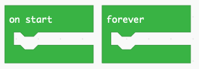

Introduction
============

Ce tutoriel est une introducation à la programmation du robot **LEGO MINDSTORMS EV3**
utilsant le language graphique **Microsoft MakeCode**.

Pour programmer ton robot tu dois dois aller sur le site: 

https://makecode.mindstorms.com/#editor 

La programmation est entièrement online.

Associer une image à chaque bouton
----------------------------------

Dans ce programme nous association chaqun des 5 boutons avec

- une image
- un son
- une lumière clignotante

Nous pouvons aussi tester le résultat dans le programmation

.. image:: intro1_gui.png

Share project
-------------

Link
----

https://makecode.com/_Ky46q7HK85bi

Code
----

.. raw:: html

    

    <iframe style="position:absolute;top:0;left:0;width:100%;height:100%;" src="https://makecode.mindstorms.com/---codeembed#pub:_Ky46q7HK85bi" allowfullscreen="allowfullscreen" frameborder="0" sandbox="allow-scripts allow-same-origin"></iframe>

Editor
------

.. raw:: html

    
<iframe style="position:absolute;top:0;left:0;width:100%;height:100%;" src="https://makecode.mindstorms.com/#pub:_Ky46q7HK85bi" frameborder="0" sandbox="allow-popups allow-forms allow-scripts allow-same-origin"></iframe>

Simulator
---------

.. raw:: html

    
<iframe style="position:absolute;top:0;left:0;width:100%;height:100%;" src="https://makecode.mindstorms.com/---run?id=_Ky46q7HK85bi" allowfullscreen="allowfullscreen" sandbox="allow-popups allow-forms allow-scripts allow-same-origin" frameborder="0"></iframe>
