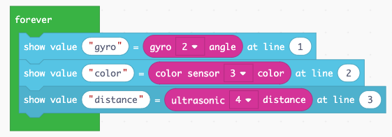

Sensors
=======

The EV3 has multiple sensors such as:

- touch sensor
- color sensor
- light sensor
- gyro sensor
- ultrasonic sensor

Touch sensor
------------

Each time you press the touch sensor, the eyes with the hearts appear and a sound is played.

.. image:: touch1.png

You can test his inside the simulator. 
When you click with the mouse on the touch sensor icon, the image and the sound appear.

Connect the touch sensor to port 1.
When you press the touch sensor, a heart is displayed.
When you release the touch sensor, the screen is cleared.

Colour sensor
-------------

Connect the color sensor to port 3.
When you place a blue LEGO brick in front of the sensor, it says *blue*.
When you place a red LEGO brick in front of the sensor, it says *red*.

Show values to the screen
-------------------------

You can use a **forever** loop to write the sensor values to the screen.

In the simulation in the navigator window you can set different values 
for the sensor and display the values on the first three lines of the screen.

