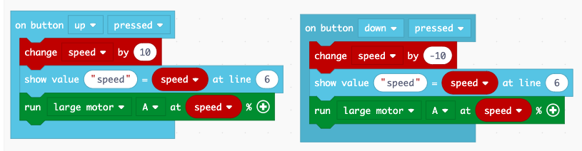

Motors
======

Motors let you move your robot.

Display a welcome screen
------------------------

Let's write some explanations to the display.
It is always good to give the user some hints about what the program is doing.
Let's explain how to use the 3 buttons to control the large motor on port A.

.. image:: motor1.png

Move a motor
------------

Now let's use the buttons to make the motor move.

Before downloading the program to the brick, you can test it in the simulation.

Change the motor speed
----------------------

Make a new program called **motor2**.
This time we will include that name in the welcome screen.

We are going to use the **up/down** button to increase or decrease the speed.
For this we will need a variable **speed**.

When pressing the **up** button we increase the **speed** variable by 10.
When pressing the **down** button we decrease the **speed** variable by 10.

You can try this program in the simulator before you download it to the brick.

:download:`motor2.uf2 <motor2.uf2>`

