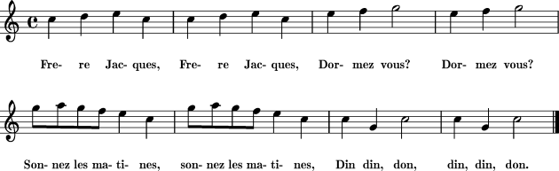

Music
=====

The EV3 brick can produce sounds.

Play a melody
-------------

Let's program the musical score of *Frère Jacques* a popular French song.

We start the first measure when pressing the center button.

To select the note to play, just click on the name, for example *Middle C*,
and select another note on the piano scale keyboard.

Repeat a melody
---------------

To repeat a part of the melody, place it inside a loop. 
For exemple the first measure needs to be repeated twice.

Longer and shorter notes
------------------------

So far our notes had a duration of one beat.
We can increase to the duration to two beats, which is required in the second mesure.

The next measure has 4 notes with only half a beat.

The last measure has long note again.

Change the tempo
----------------

The next part allows you to change the tempo.
The tempo of the music is measured in **beats per minute** (bpm).
Let's make a program to display the inital tempo.

When you run the simulation you see that the temp is 120 bpm.

Now let's program two buttons to increase and decrease the tempo.

- The **up** button makes the tempo faster by 20 bpm (beats per minute).
- The **down** button decreases it by 20 bpm.

Change the volume
-----------------

To keep track of the volue we need to create a variable.

.. image:: music3.png

We can **set this variable** to 5 in the **start** block.
The we set the volume using this variable.
And finally we display its value on line number 4.

Finally we program the **left/right** buttons to increase or decrease the volume.

