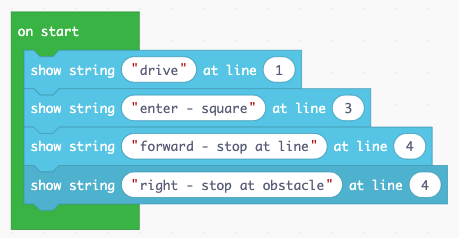
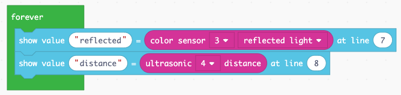
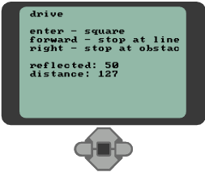
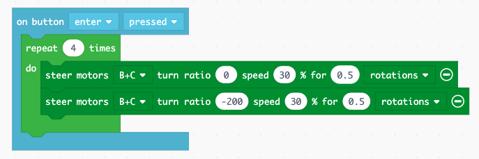
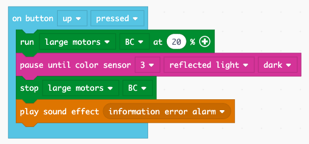

Driving
=======

The EV3 has special commands for controlling the two large motors for moving the robot around.

Use the buttons to drive
------------------------

First we display a small user guide on the EV3 display.

.. image:: drive1.png

At this point we can test the display and the presence of the two large motors.

.. image:: drive1s.png

Move forward and backward
-------------------------

The robot moves forward if both motors turn forward (50%) at the same speed.
The robot moves backward if both motors turn backward (-50%) together.

.. image:: drive2.png

Turn left and right
-------------------

The robot turns left if 

- motor B goes backwards (-50%)
- motor C goes forward (50%)

The robot turns right if 

- motor B goes forward (50%)
- motor C goes backward (-50%)

.. image:: drive3.png

Display a start screen
----------------------

It's always good practice to display on the screen what the robot is doing.
We place that code inside the **on start** block.

This robot can execute 3 behaviors:

- drive a square
- advance till it reaches a dark line or the border of the table
- advance till the distance sensor detects a nearby object

Display the sensor values
-------------------------

It is useful to display the measured sensor values on the screen.
We place this code into the **forever** block, 
as we want to do these measurements continously.

The result on the screen will be this

Drive along a square
--------------------

We repeat 4 times inside a loop a straight segment and a 90-degrees turning segment.
The robot will execute a square trajectory.

Stop at a line
--------------

We program the light sensor to make the robot stop when the light intensity goes down.

Stop at an obstacle
-------------------

We program the ultrasonic distance sensor to stop the robot when an object is near.

You can download this file and import it into MakeCode.

:download:`lego-drive.uf2 <lego-drive.uf2>`

