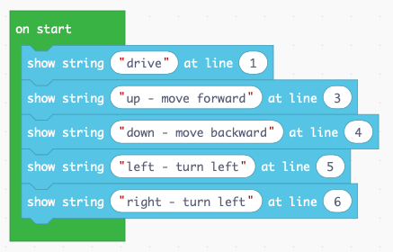
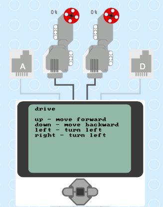
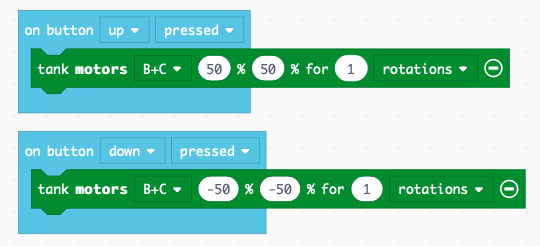
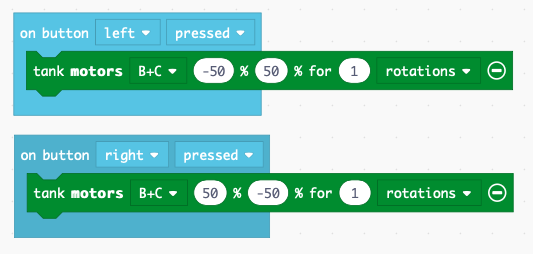

Driving
=======

The EV3 has special commands for controlling the two large motors for moving the robot around.

Use the EV3 buttons to drive
----------------------------

First we display a small user guide on the EV3 display.

At this point we can test the display and the presence of the two large motors.

Move forward and backwards
--------------------------

The robot moves forward if both motors turn forward (50%) at the same speed.
The robot moves backward if both motors turn backward (-50%) together.

Turn left and right
-------------------

The robot turns left if 

- motor B goes backwards (-50%)
- motor C goes forward (50%)

The robot turns right if 

- motor B goes forward (50%)
- motor C goes backward (-50%)

